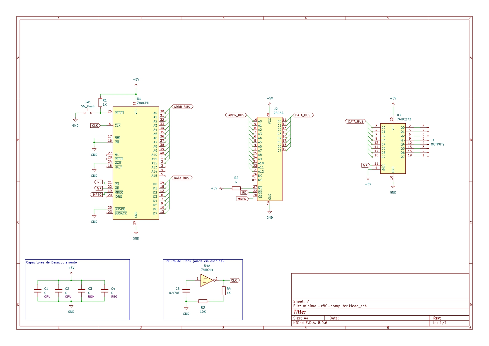
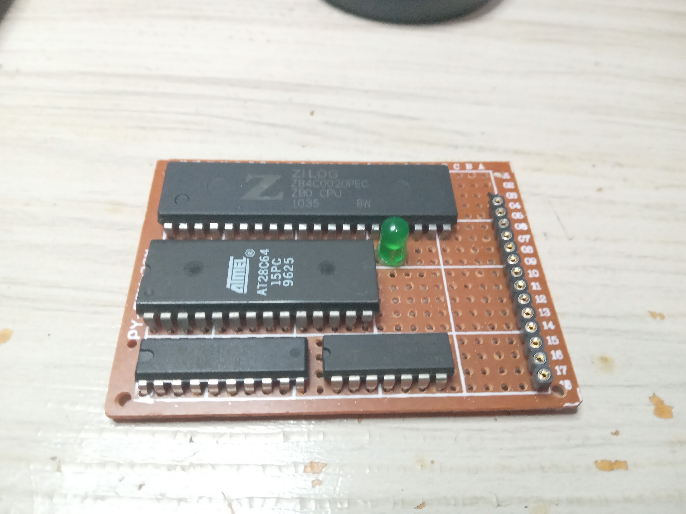

# z80-minimal-computer

Um computador Z80 "mínimo", que utiliza **apenas 4 chips**:

- Zilog Z80 (CPU de 8 bits)
- 28C64 (EEPROM de 8KB)
- 74HC273 (Registrador de 8 Bits)
- 4093 (Schmitt trigger NAND)

O objetivo deste projeto é **mostrar o que é necessário para fazer um computador funcionar do zero**, sem devboards, microcontroladores ou sistemas prontos — só o essencial.

> Claro, isso não é um "computador" como conhecemos hoje.  
> Ele não tem saída de vídeo, nem memória RAM (ainda).  
>  
> "Mas então, *pra que ele serve?"*  
>  
> Além de ser uma forma prática de refrescar minhas habilidades com processadores antigos, esse projeto é uma ótima maneira de **entender — no mais baixo nível — como um computador funciona**: sinal por sinal, instrução por instrução.

O esquema pode ser visualizado na imagem abaixo, ou baixado por [aqui](./files/minimal-z80-computer.kicad_sch). Não se esqueça de importar a [biblioteca](./files/libs.kicad_sym) para evitar conflitos.

---

## Imagens

| Esquemático (KiCad) | Placa |
|----------------------|------------------------|
|  |  |

---

## Como programar

Todo o código do sistema é escrito em **Assembly Z80**, e depois compilado para um arquivo `.bin` ou `.hex`, que será gravado diretamente na EEPROM (28C64, de 64k).

Para isso, costumo utilizar um **gravador TL866**, mas você pode usar qualquer outro método — até mesmo um gravador caseiro com Arduino — contanto que consiga carregar o binário na EEPROM.

Depois de gravado o programa, basta inserir a EEPROM no soquete da placa, alimentar tudo com **5V estáveis** no VCC do sistema, e assistir à mágica acontecer.

---

## Como funciona

Assim que ligado, o Z80 sempre busca sua **primeira instrução no endereço 0x0000**.  
Como o único armazenamento disponível no projeto é, por enquanto, a ROM (EEPROM), a CPU simplesmente começa a executar o conteúdo byte a byte, diretamente da memória.

Além disso, há um 4093 que servirá como uma NOT Schmitt trigger, que permite gerar uma onda quadrada com um circuito retroalimentável e com alguns resistores e um capacitor. Embora não seja um clock de altíssima frequência (na verdade está um tanto longe dos 4 Mhz que o Z80 suporta), é o suficiente para poder acompanhar maneira mais "didática" o funcionamento da CPU. 

---

### Para que serve o registrador?

Bem, você pode criar um programa simples em Assembly, gravá-lo na EEPROM e executá-lo. Mas aqui temos o problema: **sem saída de vídeo, som ou periféricos**, como é possível saber o que está acontecendo?

Dá para simplesmente confiar que tudo deu certo... ou então verificar com um analisador lógico para inspecionar bit a bit o barramento de dados.

Por conta disso, o computador tem um **registrador 74HC273**, que funciona como uma **interface de saída controlada pela CPU**.

Na prática, a CPU pode escrever um byte no registrador, e esse valor será mantido nos pinos do CI até ser sobrescrito (por um sinal de escrita /WR vindo do processador). Isso abre espaço para poder interagir e ligar muito mais coisas na CPU:

- **LCD**: Onde podemos usar 4 bits para dados e 4 para controle
- **Matriz de LEDs**: Apenas por diversão, ou para visualizar/registrar o conteúdo de algo
- **Registrador de deslocamento**: expandir o número de saídas do sistema
- **Controle de motores ou relês**: acionar cargas diretamente da CPU, através do chaveamento de transistores/optoacopladores
- Ou simplesmente **verificar o valor de saída no osciloscópio ou multímetro**

---
